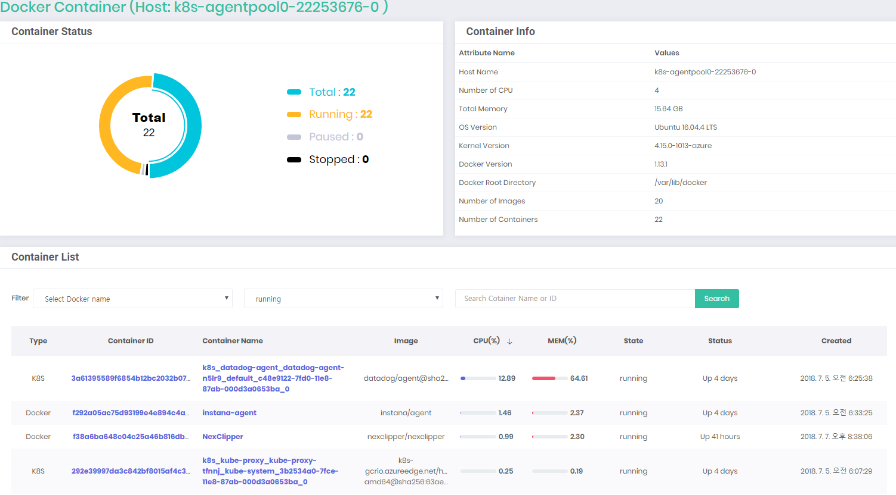

## [What is NexClipper?](https://github.com/TheNexCloud/NexClipper)

NexClipper light is the simple and easy container monitoring tool which to collects statistics, status, process, network, environment, volume, and log.

<!--truncate-->

## [](https://github.com/TheNexCloud/NexClipper#feature-overview)Feature Overview

NexClipper features the following capabilities:

- Dashboard
- Container list
- Status of containers (total continers, running, paused, stopped)
- Number of Images
- Container resource usage (cpu, memory, network, block i/o)
- Container process, network , environment, network, logs

# [](https://github.com/TheNexCloud/NexClipper#quick-start-running-nexclipper-in-a-docker-container)Quick Start: Running NexClipper in a Docker Container

You can run NexClipper to monitor the docker containers. Simply run:

```
sudo docker pull nexclipper/nexclipper;` `sudo docker run \ --detach=true \ --name NexClipper \ -p 10001:9001 \ --volume /var/run/docker.sock:/var/run/docker.sock \ --volume /var/lib/docker:/var/lib/docker \ nexclipper/nexclipper;
```

**NexClipper is now running (in the background) on [http://localhost:10001](http://localhost:10001/).**

## [](https://github.com/TheNexCloud/NexClipper#web-ui)Web UI

NexClipper exposes a web UI at its port: **http://:/**

## [](https://github.com/TheNexCloud/NexClipper#dashboard)Dashboard

The dashboard shows the container's statistics, status, logs, and various information.




