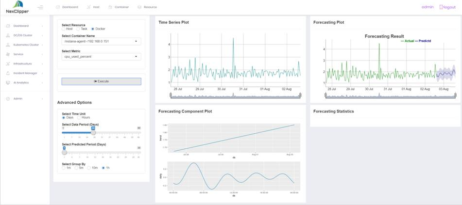
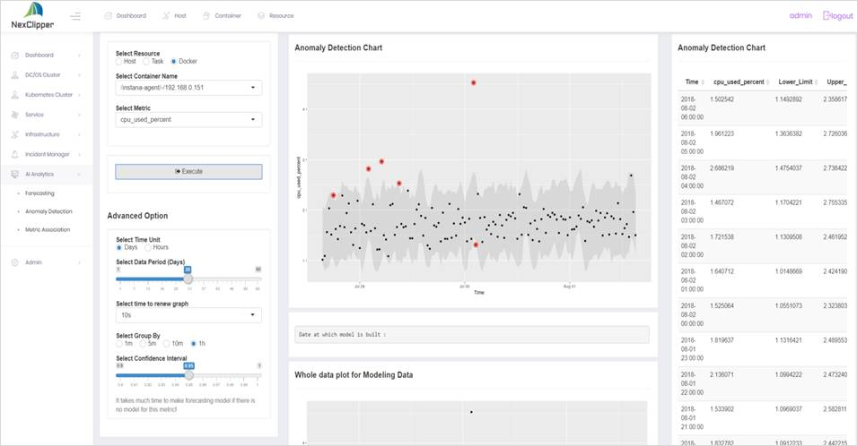

In “AI Analytics”, we provide three submenus as below, please see below for brief descriptions.

<!--truncate-->

l **Forecasting**

l **Anomaly Detection**

l **Metric Association**

**Forecasting**

Forecasting is the first step to anomaly detection which is to predict what the metric we are interested in should show for a given situation under current and future conditions.

**_\[Screen capture\]_**

**Anomaly Detection**

Anomaly detection is the identification of data points, items, observations or events that do not conform to the expected pattern of a given group. These anomalies occur very infrequently but may signify a large and significant threat such as cyber intrusions or fraud.

Here, the paragraph, “conform to the expected pattern” is the most important. In other words, finding anomalies means finding a case that is hard to happen in a normal situation.

See the following link for more information : [The Concept of NexClipper’s Anomaly Detection Algorithm](https://www.nexclipper.io/the-concept-of-nexclippers-anomaly-detection-algorithm/)

**_\[Screen capture\]_**

**Metric Association**

The first step in detecting system anomalies is to numerically determine what similarity each metric has. Here, we can measure the similarity of the time series of each metric and group them to analyze the cause.

**_\[Screen capture\]_**

**Please Contact, NexCipper, to use alpha version “AI Analytics” Menu**

 

l Please contact us at the following e-mail address : [support@nexclipper.io](mailto:support@nexclipper.io)

l Your request email should include your company name and email address.

