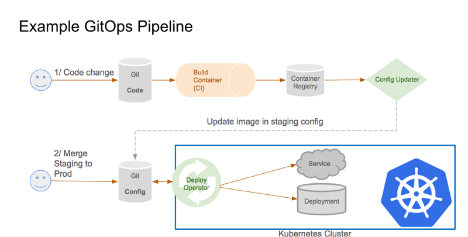
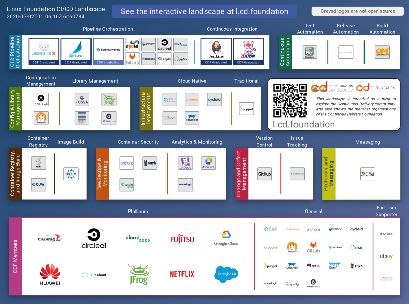

안녕하세요. 넥스클라우드 김진웅입니다.

이번 포스팅에서는 약간 다른 주제를 다뤄보려고 합니다. 개발자 입장에서의 프로메테우스 활용을 고민하다가 아이디어가 있어서 컨셉 정리차도 있고, 실제로 이유는 7월 14–16일에 진행되었던 PromCon 2020 행사에 Lightning Talk 로 5분간 발표를 하게 되었는데 너무 짧은 시간이다 보니 관련된 내용들을 기록에 남기려고 정리했습니다.

오늘 소개해보려고 하는 컨셉은 간단합니다.

> _MetricOps — 종속적이지 않고 중립성 있게 SLO기반으로 GitOps 기반 배포와 롤백을 통한 서비스 운영_

<!--truncate-->

따로 언급하지는 않겠지만 다른 상용 솔루션 및 SaaS제품에는 최근 이러한 기능들이 추가되고 있는것 같습니다.

물론 저희가 만드는 [NexClipper](https://nexclipper.io) 로드맵에도 포함 되어있습니다.

* * *

### GitOps

기본적인 컨셉은 GitOps에서 출발합니다.

참고 : [https://www.weave.works/technologies/gitops/](https://www.weave.works/technologies/gitops/)

GitOps Pipeline

자세한 내용은 [커피고래님 블로그](https://coffeewhale.com/kubernetes/gitops/argocd/2020/02/10/gitops-argocd/)에 한글로 설명이 잘 되어 있습니다.

참고 : [https://coffeewhale.com/kubernetes/gitops/argocd/2020/02/10/gitops-argocd/](https://coffeewhale.com/kubernetes/gitops/argocd/2020/02/10/gitops-argocd/)

간단하게 정리를 해보면 GitOps의 장점은 아래와 같다고 말할 수 있습니다.

- 단일한 Source에서의 단일한 방법으로 배포
- 항상 원천의 상태를 완벽히 반영하기 때문에 운영환경이 아닌 원천만 살펴 본다.
- git 저장소를 SSOT(Single source of truth)로 사용하여 GitOps의 구현체 (ArgoCD, Flux등)를 활용해서 운영환경에 변경 사항을 배포하는 것
- 쿠버네티스와 같은 선언형 명령(declarative description)을 통해 Git 저장소에 배포형태를 선언하면 그것을 운영환경에 반영

* * *

### SLO

**SLO**라고 하는 용어는 **SLI**, **SLA**와 함께 많이들 들어 보셨을텐데요.

(참고 : [https://landing.google.com/sre/sre-book/chapters/service-level-objectives/](https://landing.google.com/sre/sre-book/chapters/service-level-objectives/))

서비스를 오픈하고 서비스 상태를 식별하는 지표(일반적으로 http\_request\_count 와 같은 메트릭 지표)를 정하고 나면 고객이나 우리가 원하는 안정성 수준을 결정해야 합니다. 개발팀과 운영팀이 같이 만든 원하는 안정성 수준을 **SLO**(서비스 수준 목표)라고 합니다.

**SLO**는 Prometheus나 Datadog과 같은 모니터링 시스템을 활용하여 정확하게 측정하고 표시해야 합니다. 서비스의 안정성에 대해서 명확하게 이해할수 있는 목표이기도 합니다. 반드시 **SLO**를 만족하는지 못하는지 명확한 측정값으로 데이터가 존재해야 하고 **SLO**를 충족하지 못하면 문제가 있는것으로 판단하고 문제를 해결해야 합니다.

기존에 Prometheus Adapter를 활용하여 Custom Metric으로 HPA(Horizontal Pod Autoscaling)을 구현하는 튜토리얼이나 컨셉은 많이 있었습니다.

용찬호님 블로그 : [https://blog.naver.com/alice\_k106/221521978267](https://blog.naver.com/alice_k106/221521978267)

문진수님 발표자료 : [https://www.slideshare.net/jinsumoon33/kubernetes-prometheus-monitoring](https://www.slideshare.net/jinsumoon33/kubernetes-prometheus-monitoring)

제가 여기서 좀더 나아가고자 한건 애플리케이션을 배포하고 난 이후의 운영단계에서의 SLO기반으로 관리를 하는 컨셉을 고민하고 있습니다.

AlertRule을 SLO기반으로 생성해주는 웹 기반 도구 : [https://promtools.dev/](https://promtools.dev/)

* * *

### CD(Continuous Delivery)

주로 운영상황에서 배포에 관련된 내용이니 Continuous Delivery(지속적 전달) 관련한 이야기를 해보겠습니다.

지속적 전달은 지속적 통합(CI: Continuous Integration)단계에서 빌드가 완료된 최종 패키지와 애플리케이션 패키지를 테스트와 스테이징, 프로덕션과 같은 다양한 운영 환경에 배포까지 진행하는 과정이라 할 수 있습니다.

이미 많이 알고 계시고 관련한 블로그도 많으니 여기서 간단하게 정리하기로 하고

CD.FOUNDATION 를 소개 드리고자 합니다.

[https://cd.foundation/](https://cd.foundation/)

CD.FOUNDATION는 Linux Foundation 산하에 있는 독립적인 기관으로 다양한 CI/CD를 위해 2019년 3월에 만들어진 재단입니다.

[https://landscape.cd.foundation/](https://landscape.cd.foundation/)

CD Landscape

다들 Jenkins는 사용해보셨거나 사용중이실걸로 알고 있습니다. Jenkins와 몇가지 OpenSource기반의 CD 플랫폼이 해당 재단에 가입되어 있고 많은 글로벌 멤버사들이 후원 및 표준을 위해 참여를 하고 있습니다.

[cd.foundation](http://cd.foundation) 웹사이트나 [https://landscape.cd.foundation/](https://landscape.cd.foundation/) 랜드스케이프쪽에 가시면 여러 멤버사들을 보실수 있는데 현재 가장 메인이 되는 프로젝트는 Jenkins, JenkinsX, Spinnaker, Tekton 등이 있습니다. 예전에 개인 블로그에서 Spinnaker 관련한 내용을 연재한 적이 있는데 지금은 또 다른 환경으로 변화해가고 있습니다.

[https://ddii.dev/kubernetes/spinnaker-advanced-1/](https://ddii.dev/kubernetes/spinnaker-advanced-1/)

[https://ddii.dev/kubernetes/spinnaker-advanced-2/](https://ddii.dev/kubernetes/spinnaker-advanced-2/)

[https://ddii.dev/kubernetes/spinnaker-advanced-3/](https://ddii.dev/kubernetes/spinnaker-advanced-3/)

18년도에 남긴 3번째 포스팅에 보면 kayenta라는 Automated Canary Analysis (ACA) 오픈소스에 관련된 내용도 참고하시면 좋을 것 같습니다.

MetricOps 컨셉은 아래 영상을 참고하시기 바랍니다.

\[embed\]https://www.youtube.com/embed/xOya8uWrVk0\[/embed\]

PromCon Online 2020 — Lightning Talks Day2, MetricOps

* * *

제가 구현해 보려는 컨셉은 다음과 같습니다.

- 기존에 GitOps 형태로 코드를 배포
- Python prometheus client로 metric expose, prometheus에서 수집, 모니터링
- Feedback Pipeline(가칭) 앱 배포 : kube-api에 rollback 명령 전달용 Container
- 배포시 정보를 전달하기 위한 Mutation Admission Webhook container 배포
- 개인 블로그 : [https://ddii.dev/kubernetes/mutating-web-hook/#](https://ddii.dev/kubernetes/mutating-web-hook/#) 용찬호님 블로그 : [https://m.blog.naver.com/alice\_k106/221546328906](https://m.blog.naver.com/alice_k106/221546328906)
- 해당 컨테이너는 배포시점의 Image Tag, TimeStamp, Label, Rule 정보를 Feedback Pipeline API로 전달
- Rule 정보는 배포하는 담당자가 정의 예) `rate(http_request_total{code=~"^5.*$"}[5m]) >0` 5xx에러가 5분 window내 한번 이상 발생하는 경우
- Feedback Pipeline 앱이 해당 alertrule 을 모니터링 하다가 Firing 상태가 될 경우 rollout undo API로 이전 버전으로 rollback

* * *

### 정리

현재 CI/CD는 SaaS와 오픈소스를 포함한 솔루션이 난립하고 있는 형국으로, Jenkins, JenkinX와 같이 오래되기도 했고 유저층이 두터운 솔루션과, 최근 몇년간 구글과 넷플릭스, 삼성전자 같은 대기업 주도로 spinnaker와 같은 도구가 유행을 했다면 최근에는 중소팀이나 스타트업, 오픈소스 분야에서는 CircleCI, Github Action, Tekton, Skaffold과 같은 pipeline 형태의 도구들이 유행하기도 했습니다. 하지만 점점 복잡해지는 환경에서 ArgoCD 와 같은 선언형(declarative) 도구가 트렌드를 주도하고 있습니다. 언제나 배포는 운영자의 입장에서 가장 고통스러우면서 설레는 일입니다. 이런 scaling 뿐만 아닌 rollback 이나 Feedback 정보를 투명하게 누구나 볼 수 있으면 좋지 않을까 하는 생각에서 포스팅을 작성 해봤습니다.

마지막으로 현재 NexCloud에서는 OSS기반으로 개발 중인 NexClipper Cloud 서비스와 Exporter Catalog 관련 서비스를 연동해서 사용할 Exporter를 탐색, 생성하는 기능을 연동하는 기능을 9월 정도에 출시할 예정입니다.

궁금하시면 언제든지 연락주시고 찾아뵙거나 화상으로도 제품소개가 가능합니다.

많은 기대 부탁드립니다.

* * *

### 넥스클라우드 소개 및 채용

[넥스클라우드](https://www.nexclipper.io/)는 컨테이너 기반 클라우드 기술 회사입니다.

2020년 하반기부터 본격적인 글로벌 사업을 위해 현재 미국 법인 설립을 진행 중이며 능력있는 분들을 모시고 있습니다.

[개발자 (Engineer) 부문](https://www.notion.so/nexclipper/Engineer-a83352e7b6a24bbbb1ac77bf83a7026b) (Front-End)

[Product Marketing Manager](https://www.notion.so/nexclipper/Job-description-63e5113b79a943f28a75c1eca1e0f50a)

[Cloud Platform Consulting Manager](https://www.notion.so/nexclipper/Cloud-Platform-Consulting-Manager-871f792b04994afeb40984dbe05da386)
