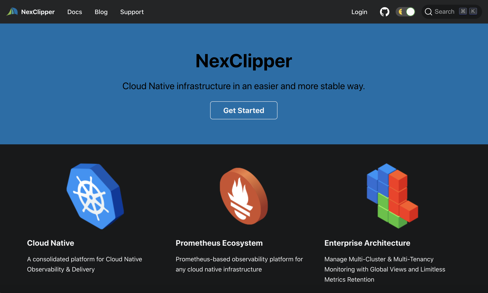
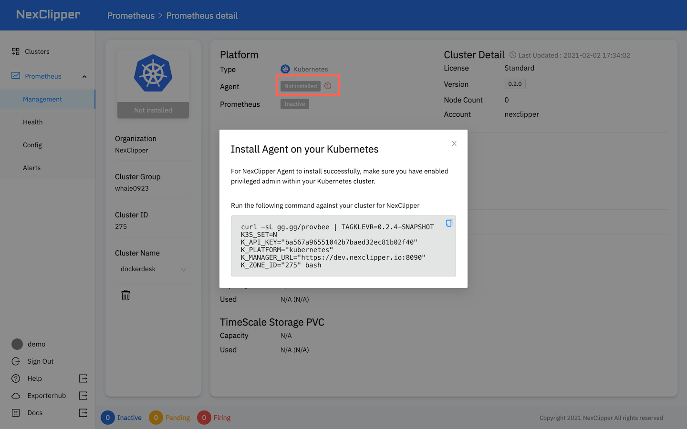
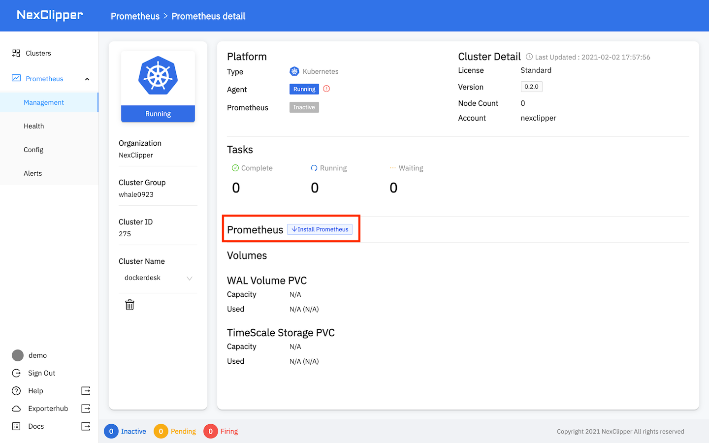
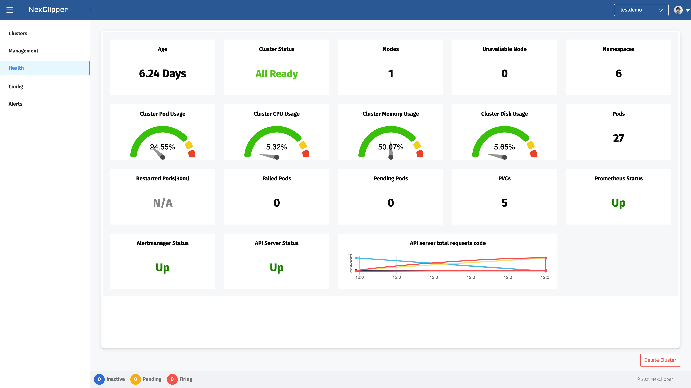
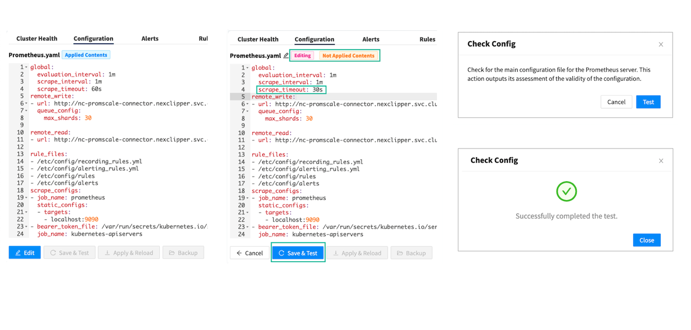
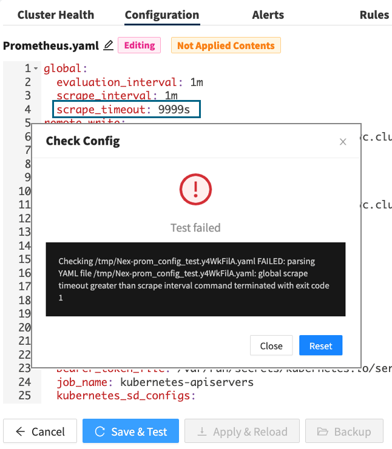
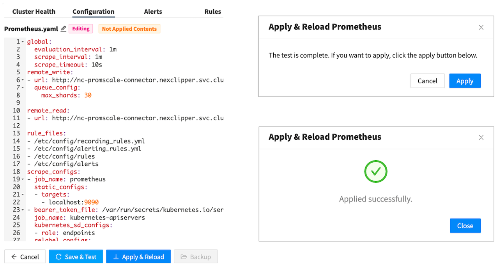
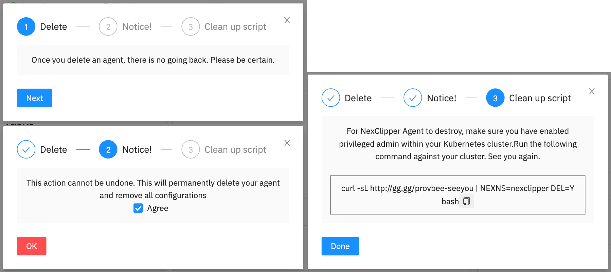

## Getting Started with NexClipper Cloud

### Overview

NexClipper has three main components:    
NexClipper runs in the type of DaemonSet, StatefulSet, and Deployment within Kubernetes cluster.  
All resources run in the nex-system, nexclipper Namespace by default, and contain ecosystem related to Prometheus.

|Component|Resource|Role|
|---|---|---|
|Klevr Agent|DaemonSet|Communicate with NexClipper Manager|
|Provbee|Deployment|Provisioning and Task Processing|
|Prometheus|Deployment|Metric-Based Monitoring Tool|
|node-exporter|DaemonSet|Machine Metric Collection Exporter|
|Grafana|Deployment|Visualization Dashboard Tool|
|Kube-state-metrics|Deployment|Cluster Metric Collection Tool|
|Alertmanager|Deployment|Alarm Management Tools|
|pushgateway|Deployment|Small Batchjob Metric Collection Tool|
|Promlens|Deployment|Query Builder based on PromQL|
|Promscale|Deployment|Prometheus Metric Analysis Tool|
|TimescaleDB|StatefulSet|Time Series-Based SQL DB|
|MetricOperator|Deployment|Caching Cluster State|
|NexCloud Basic|Deployment|Basic Dashboard|
|ExporterHub(Preparing)|Deployment|Exporter curation page|

:::note
NexClipper Agent has been tested for Kubernetes version 1.15.12 or higher. Problems may occur in lower versions.
:::

---

### Minimum Requirements

NexClipper runs in a Linux environment.

* Operating Systems : Linux(WSL included), MacOS 10.14+
* Software
  * bash or zsh
  * curl
  * ssh-keygen
* Target Kubernetes Cluster : 1.15.12 or higher
* Firewall
  * Client(WebService) -> Outbound (Destination : console.nexclipper.io, Port: 80,443,8080)
  * NexClipper Agent(DaemonSet) -> Outbount (Destination : console.nexclipper.io, Port: 8090)
---

### Check Environment

There are two options for installation.  

1. Remote Kubernetes
   * An environment that can communicate remotely to kube-apiserve (kubeconfig environment)
2. Local Kubernetes
   * When running locally, such as Docker Desktop, Minikube, K3s, MicroK8s, etc.


Run the following command to check the currently connected cluster in an environment that can run bash or zsh. If you have configured your Kubernetes environment with docker-desktop, you are expected to get results similar to the following:

```bash
$ kubectl cluster-info
Kubernetes master is running at https://kubernetes.docker.internal:6443
KubeDNS is running at https://kubernetes.docker.internal:6443/api/v1/namespaces/kube-system/services/kube-dns:dns/proxy
```

:::caution
You might encounter problems if you install duplicates with an existing operating Prometheus Operator. NexClipper distributes and manages Prometheus-related ecosystem based on Helm.
:::

---

### Install NexClipper

Go to [https://nexclipper.github.io/](https://nexclipper.github.io/) and click on `Login`.




Go to [https://console.nexclipper.io/login](https://console.nexclipper.io/login) Page.


:::info
Currently, we only support e-mail and Google Authentication (including GSuite). If you need to use NexClipper, please contact support@nexclipper.io.
:::

Log in with your Account.

Welcome page will be displayed for first-time users.


NexClipper is similar to Kubernetes cluster, but with a different concept. It works based on a logical group called a Cluster where a separate NexClipper Suite is installed. In order to issue API KEY mapped to your account, follow these steps.

Type a Cluster Name. The Cluster Name is a value shown in the list and is an input value for the user to distinguish the cluster.


Select a target platform or infrastructure to provision.

:::info
Currently, only Kubernetes clusters are supported. We will also provide a Baremetal, Instance, or Laptop environment and a Public Cloud environment.
:::


A bootstrap script will be created to install on the selected platform.


Run the generated script from zsh, bash-enabled Bastion, or Local.

For Kubernetes environments, run the script below.
```sh
curl -sL gg.gg/provbee | TAGKLEVR=0.2.4-SNAPSHOT K3S_SET=N K_API_KEY="977b9d295d0f4273be3575cdaeae22b3" K_PLATFORM="kubernetes" K_MANAGER_URL="http://console.nexclipper.io:8090" K_ZONE_ID="62" bash
```

If it is not Kubernetes environment such as local and laptop, run the script below. The script will be installed based on K3s.
```sh
curl -sL gg.gg/provbee | TAGKLEVR=0.2.4-SNAPSHOT K3S_SET=Y K_API_KEY="977b9d295d0f4273be3575cdaeae22b3" K_PLATFORM="kubernetes" K_MANAGER_URL="http://console.nexclipper.io:8090" K_ZONE_ID="62" bash
```

```sh
NexClipper serivce first checking
[INFO]   Welcome to NexClipper!
namespace/nex-system created
serviceaccount/nexc created
secret/nexc-ssh-key created
secret/nex-secrets created
configmap/nex-system-agent-config created
role.rbac.authorization.k8s.io/nexclipper-role created
clusterrolebinding.rbac.authorization.k8s.io/nexc-rbac created
rolebinding.rbac.authorization.k8s.io/nexclipper-rb created
Cluster "docker-desktop" set.
User "nexc-nex-system-docker-desktop" set.
Context "nexc-nex-system-docker-desktop" modified.
Switched to context "nexc-nex-system-docker-desktop".
secret/nexc-kubeconfig created
service/provbee-service created
deployment.apps/provbee created
daemonset.apps/klevr-agent created
:+:+:+:+:+:+:+:+:+:+:+:+:+:+:+:+:+:+:+:+:+:
## Namespace "nex-system" check	  OK.
## NexClipper system check	  OK. 🍯❤️🐝
 ⛵ Enjoy NexClipper! :)
:+:+:+:+:+:+:+:+:+:+:+:+:+:+:+:+:+:+:+:+:+:
88888888ba                                         88888888ba
88      '8b                                        88      '8b
88      ,8P                                        88      ,8P
88aaaaaa8P'  🐝,dPPYba,   ,adPPYba,   8b       d8  88aaaaaa8P'   ,adPPYba,   ,adPPYba,
88'''''''    88P'   'Y8  a8'     '8a  '8b     d8'  88''''''8b,  a8P_____88  a8P_____88
88           88          8b       d8   '8b   d8'   88      '8b  8PP'''''''  8PP'''''''
88           88          '8a,   ,a8'    '8b,d8'    88      a8P  '8b,   ,aa  '8b,   ,aa
88           88           ''YbbdP''       '8'      88888888P'    ''Ybbd8''   ''Ybbd8''
```

Click on `Continue` and go to the next step.

After Klevr and Provbee are installed, you will be able to communicate with NexClipper Manager server. If the installation script is not running, you can see it on the following page. 



You can also check the agent installation status through kubectl.

Klevr agent (DaemonSet), Provbee (Deployment) will be created in the nex-system Namespace.

```sh
> kubectl get pod -n nex-system
NAME                         READY   STATUS    RESTARTS   AGE
klevr-agent-8dh6g            1/1     Running   0          11m
provbee-67f8ffbf55-2tpfs     1/1     Running   0          11m
```

After the agent installation is completed, the agent status changes to Running. Then, the button to install Prometheus will be enabled.

### Install Prometheus Eco-systems



The default installation options are as follows.  


* Namespace : Kubernetes namespace where the stack will be installed
(Default: nexclipper)
* Volume Size(GB): TimescaleDB Volume Size(Default: 10Gi)
* Replicas: TimescaleDB Cluster Replicas (Default: 1)
* Storage Class Name: Storage classes to use when using separate PVs
 (Default: LocalVolume)
* Size of Wal(GB): Prometheus WAL Volume Size(Default: 2Gi)
* Grafana Admin Password : Grafana initial password(Default: admin)

The `nexclipper` Namespace will have the following Prometheus ecosystem.  

* prometheus
* node-exporter
* kube-state-metrics
* alertmanager
* grafana
* promscale
* promlens
* timescaledb

```sh
> kubectl get deploy,statefulset -n nexclipper
NAME                                         READY   UP-TO-DATE   AVAILABLE   AGE
deployment.apps/nc-grafana                   1/1     1            1           8m39s
deployment.apps/nc-kube-state-metrics        1/1     1            1           8m39s
deployment.apps/nc-prometheus-alertmanager   1/1     1            1           8m39s
deployment.apps/nc-prometheus-pushgateway    1/1     1            1           8m39s
deployment.apps/nc-prometheus-server         1/1     1            1           8m39s
deployment.apps/nc-promlens                  1/1     1            1           8m39s
deployment.apps/nc-promscale                 1/1     1            1           8m39s

NAME                              READY   AGE
statefulset.apps/nc-timescaledb   1/1     8m39s
```

Additionally, WebStork (Deployment), and MetricOps (Deployment) will be created in the nex-system Namespace.

```sh
> kubectl get deploy,daemonset -n nex-system
NAME                        READY   UP-TO-DATE   AVAILABLE   AGE
deployment.apps/metricops   1/1     1            1           10m
deployment.apps/provbee     1/1     1            1           18m
deployment.apps/webstork    1/1     1            1           10m

NAME                         DESIRED   CURRENT   READY   UP-TO-DATE   AVAILABLE   NODE SELECTOR   AGE
daemonset.apps/klevr-agent   1         1         1       1            1           <none>          18m
```

### Monitor Prometheus & Kubernetes

You can return to the console to view the list of provisioned clusters.


You can view the details of the cluster.

* Platform
  * It shows the current platform type, agent and prometheus stack status.
* Cluster Detail
  * It shows the number of nodes that currently have agents deployed and the version information and Kubernetes Account information installed.
* Tasks
  * It shows all Job and Task status performed by NexClipper.
* Prometheus
  * It shows the current installed Prometheus stack. Also,it can expose externally accessible endpoints in Prometheus ecosystem. Click on each ecosystem to view more detailed information, and you can see  each dashboard exposed on NodePort or LoadBalancer.
* Volumes
  * It shows the current PVs information and status for long-term storage.

Clicking the link or Health menu of Prometheus will take you to the Prometheus Health dashboard.



You can view the information in the cluster.  
* Age(Cluster Age): Time elapsed since cluster creation
* Cluster Status: Status of cluster nodes
  * All nodes are healthy - All Ready
  * Some nodes are healthy - Partially Ready
  * All nodes unhealthy - Not Ready
* Nodes: Number of Nodes
* Unavaliable Node: Unhealthy Node Count
* Namespaces: Number of Namespaces
* Cluster Pod Usage: Pod Utilization in Cluster
* Cluster CPU Usage: CPU Utilization in Cluster
* Cluster Memory Usage: Memory Utilization in Cluster
* Cluster Disk Usage: Disk Utilization in Cluster
* Pods: Number of active Pods
* Restarted Pods(30m): Number of Pods restarted in 30 minutes
* Failed Pods: Number of Pods in Failed state
* Pending Pods: Number of Pods in the Pending state
* PVCs: Number of PersistentVolumeClaims
* Prometheus Status: Prometheus Instance Status
* Alertmanager Status: Alertmanager Instance Status
* API Server Status: Cluster API Server Status
* API server total requests code: 5 minute average by Kubenetes API response code

### Edit & Unit Test for Prometheus Config and Alertmanager Config

Click on `Config` under Prometheus to modify the configuration in the currently provisioned state. It allows you to edit config and rules(alert, recording) on the editor screen. And you can use the `promtool test` to determine whether there is a problem with the unit test. If there is no problem, just save and apply it. 


The functions that edit and test Prometheus Configurations are operated through `Edit`, `Save & Test`. This step checks for YAML syntax errors in the config and rules.

After the test passed, the configuration will be temporarily stored, but it doesn't mean actually applied to the Prometheus cluster. 



Let's take a look at cases where the test failed. For example, `global.scrape_timeout`, you should enter a value within 60 seconds. Otherwise,it is considered abnormal and the test fails. In the case of failure, the related log is printed on the page.

  

If there is no problem with the Configuration, apply it through `Apply & Reload` and restart the Prometheus instance.



The Alert Configuration, Alert-Rule, and Recording-Rule can also be modified, tested, and applied.


### Delete Cluster

NexClipper will no longer be available after the cluster is deleted. 
Cluster must be installed if you'd like to use again. 


After several steps including consent, you can delete a cluster.



To delete NexClipper Suite completely, run the following script.

```sh
curl -sL http://gg.gg/provbee-seeyou | NEXNS=nexclipper DEL=Y bash
```


