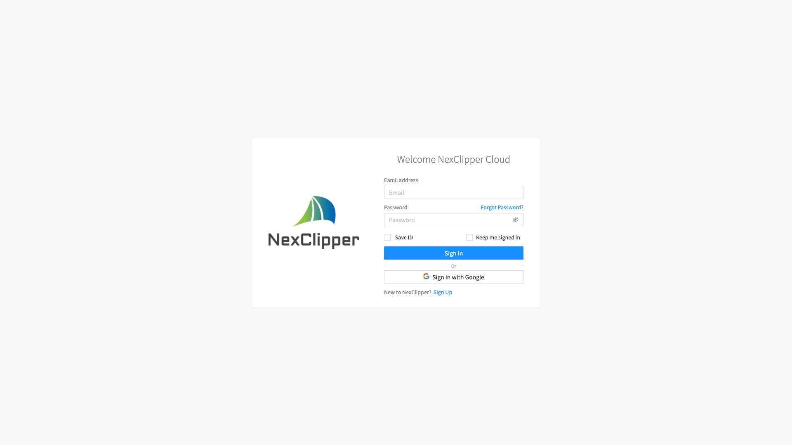
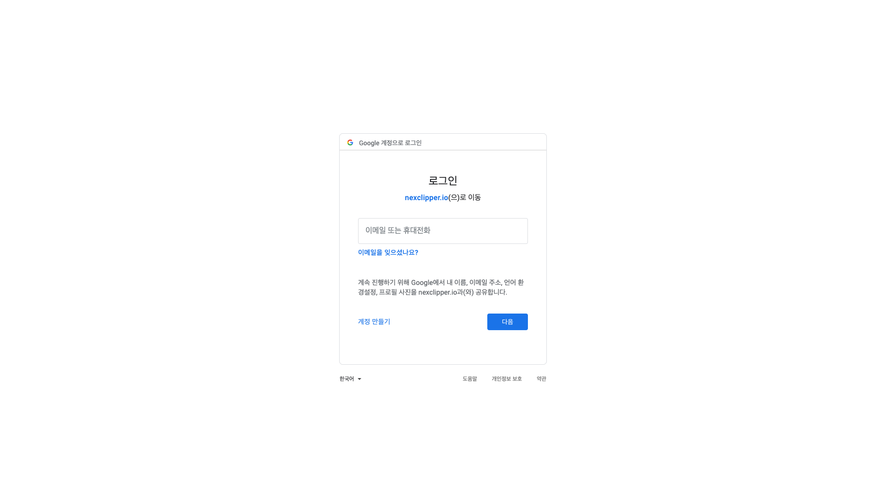
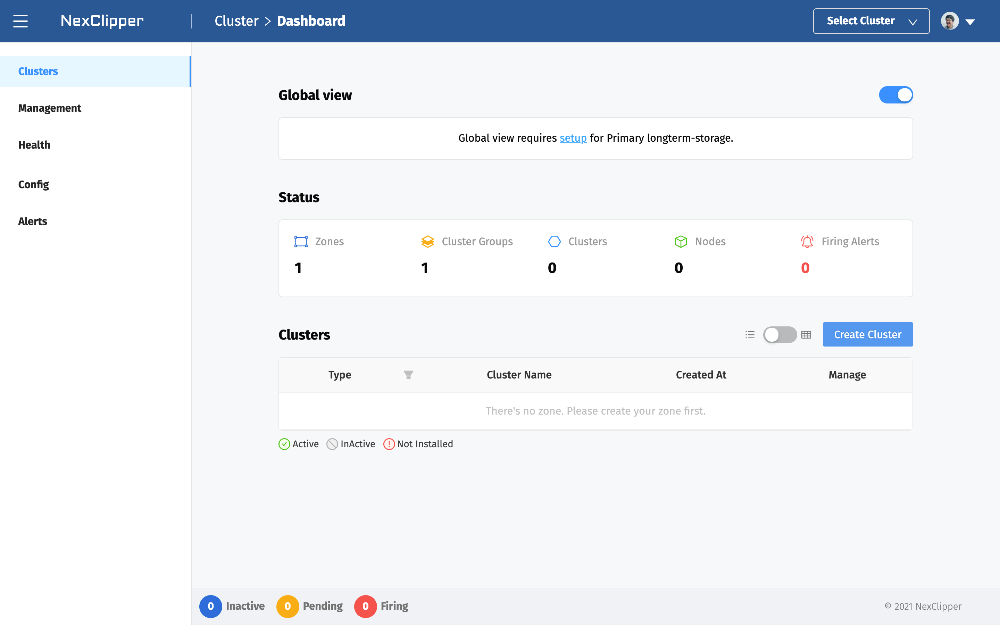
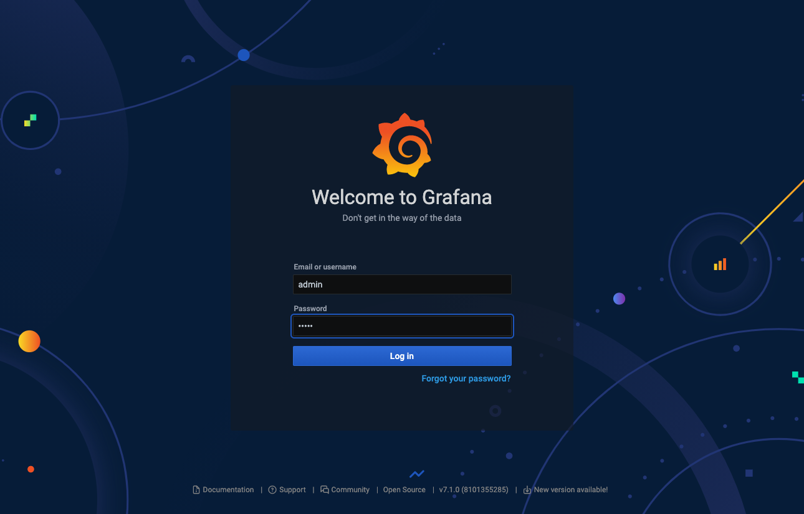
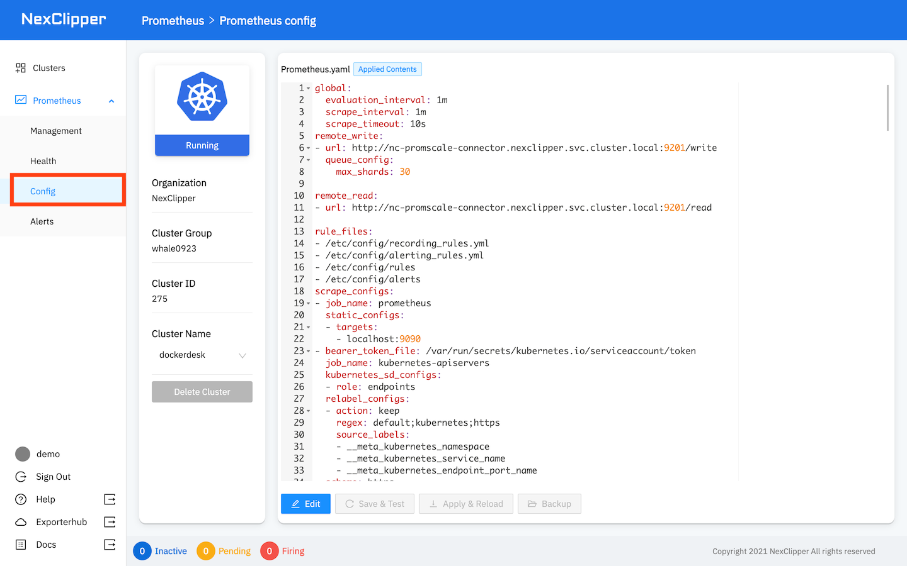

## Getting Started with NexClipper Cloud

### Overview

NexClipper 구성요소는 크게 3가지로 구성되어 있습니다.
NexClipper는 Kubernetes cluster 내에서 데몬셋(DaemonSet)과 파드(Pod), 디플로이먼트(Deployment)형태로 실행됩니다.   
모든 리소스는 기본적으로 nex-system, nexclipper 네임스페이스에서 구동되며, 프로메테우스 관련된 에코시스템들이 포함되어 있습니다.

|구성요소|리소스 타입|역할|
|---|---|---|
|Klevr Agent|DaemonSet|NexClipper Manager와 통신|
|Provbee|Pod|Provisioning 및 Task 처리|
|Prometheus|Deployment|메트릭 기반 모니터링 도구|
|node-exporter|DaemonSet|머신 메트릭 수집 Exporter|
|Grafana|Deployment|시각화 대시보드 도구|
|Kube-state-metrics|Deployment|클러스터 메트릭 수집 도구|
|Alertmanager|Deployment|알람 관리 도구|
|pushgateway|Deployment|소규모 배치 메트릭 수집 도구|
|Promlens|Deployment|PromQL 기반 쿼리 빌더|
|Promscale|Deployment|Prometheus 메트릭 분석 도구|
|TimescaleDB|StatefulSet|시계열 기반 SQL DB|
|ExporterHub(준비중)|Deployment|Exporter 큐레이션 페이지|
|MetricOperator(준비중)|Deployment|메트릭 수집, 처리, 전송|


:::note
NexClipper Agent는 Kubernetes 기준 *1.15.12* 이상에서 테스트 되었습니다. 이하 버전에서는 문제가 발생할 수 있습니다.
:::

---

### Minimum Requirements

NexClipper는 기본적으로 Linux 환경에서 동작하도록 되어 있습니다.  

* Operating Systems : Linux(WSL포함), MacOS 10.14+, WSL
* Software
  * bash or zsh
  * curl
  * ssh-keygen
* Target Kubernetes Cluster : 1.15.12 이상
* Firewall : Outbound (Destination : console.nexclipper.io, Port: 80,443,8080,8090)
---

### Installation

설치 방법은 2가지 옵션이 있습니다. 

1. Remote Kubernetes
   * 원격으로 kube-apiserver로 통신이 가능한 환경 (kubeconfig 환경)
2. Local Kubernetes
   * Docker Desktop, Minikube, K3s, MicroK8s 등 로컬에서 실행하는 경우

bash 또는 zsh을 실행할 수 있는 환경에서 현재 연결된 클러스트를 확인하는 다음 명령을 실행합니다.
docker-descktop으로 kubernetes 환경을 구성했다면 다음과 유사한 결과를 얻을 수 있습니다. 
```bash
$ kubectl cluster-info
Kubernetes master is running at https://kubernetes.docker.internal:6443
KubeDNS is running at https://kubernetes.docker.internal:6443/api/v1/namespaces/kube-system/services/kube-dns:dns/proxy
```

:::caution
기존 운영중인 프로메테우스 오퍼레이터(Operator)와 중복 설치될 경우에 문제가 발생할 수 있습니다. NexClipper는 Helm기반으로 프로메테우스 관련 에코시스템들을 배포, 관리합니다.
:::

---

### Kubernetes

[https://nexclipper.github.io/](https://nexclipper.github.io/) 로 접속하여 `Login` 메뉴를 클릭합니다.


[https://console.nexclipper.io/login](https://console.nexclipper.io/login) 로그인 페이지로 이동합니다.



:::info
현재는 구글 인증만 지원하고 있습니다. GSuite 계정 포함 Gmail 아이디로만 사용 가능합니다.
:::

Google계정으로 로그인 합니다.



최초 사용자의 경우 아래와 같이 Welcome 화면을 확인할 수 있습니다.


NexClipper는 쿠버네티스 클러스터와 유사하지만 다른 개념으로 별도의 NexClipper 제품군이 설치되는 Cluster라는 가상의 논리적 그룹 기반으로 동작합니다. Account에 맵핑된 API KEY 발급을 위해 다음 단계를 수행합니다.  

Zone Name을 입력합니다. Zone Name은 리스트에 보여지는 값으로 사용자가 Zone 또는 Cluster를 구분하기 위한 입력값입니다.



프로비저닝할 대상 클러스터 또는 인프라를 선택합니다. 

:::info
현재는 쿠버네티스 클러스터만 지원합니다. 이후 Baremetal, Instance 또는 Laptop 환경 및 Public Cloud 환경도 제공할 예정입니다.
:::


선택한 클러스터에 설치할 Bootstrap 스크립트가 생성됩니다.


생성된 스크립트를 zsh, bash 구동이 가능한 Bastion 또는 Local에서 실행합니다.

```sh
curl -sL gg.gg/provbee | TAGKLEVR=0.2.0-SNAPSHOT K3S_SET=N K_API_KEY="977b9d295d0f4273be3575cdaeae22b3" K_PLATFORM="kubernetes" K_MANAGER_URL="http://dev.nexclipper.io:8090" K_ZONE_ID="62" bash
```

`Continue`를 눌러 다음 단계로 이동합니다.  

Klevr와 Provbee 설치가 완료되기 전에는 NexClipper Cloud 서버와 통신이 되지 않기 때문에 아래와 같은 화면을 볼 수 있습니다. 만약 설치 스크립트를 실행하지 않은 상태에서는 다음 화면에서 확인할 수 있습니다.  


에이전트 설치 상태는 kubectl을 통해서도 확인할 수 있습니다.

nex-system 네임스페이스에는 klevr 에이전트 데몬셋와 provbee 파드가 생성됩니다.   

```sh
> kubectl get pod -n nex-system

NAME                READY   STATUS    RESTARTS   AGE
klevr-agent-9r5z9   1/1     Running   0          59m
klevr-agent-lcp2j   1/1     Running   0          59m
provbee             1/1     Running   0          59m
```

설치가 완료되면 아래와 같이 Agent 상태가 Running 중으로 변경됩니다. 그리고, 프로메테우스 스택을 설치할 수 있도록 기능이 활성화 됩니다.  


기본적으로 제공되는 설치 옵션은 아래와 같습니다.  


* Namespace : 스택이 설치될 쿠버네티스 네임스페이스(기본값: nexclipper)
* Volume Size(GB): TimescaleDB Volume Size(기본값: 10Gi)
* Replicas: TimescaleDB Cluster Replicas (기본값: 1)
* Storage Class Name: 별도의 PV사용시 사용할 스토리지 클래스 (기본값: LocalVolume)
* Size of Wal(GB): Prometheus WAL Volume Size(기본값: 2Gi)
* Grafana Admin Password : 그라파나 초기 패스워드(기본값: admin)

기본적으로 `nexclipper` 네임스페이스에는 다음 프로메테우스 에코시스템들이 설치됩니다. 

* prometheus
* node-exporter
* kube-state-metrics
* alertmanager
* grafana
* promscale
* promlens
* timescaledb

```sh
> kubectl get deploy,statefulset -n nexclipper
NAME                                         READY   UP-TO-DATE   AVAILABLE   AGE
deployment.apps/nc-grafana                   1/1     1            1           106s
deployment.apps/nc-kube-state-metrics        1/1     1            1           106s
deployment.apps/nc-prometheus-alertmanager   1/1     1            1           106s
deployment.apps/nc-prometheus-pushgateway    1/1     1            1           106s
deployment.apps/nc-prometheus-server         1/1     1            1           106s
deployment.apps/nc-promlens                  1/1     1            1           106s
deployment.apps/nc-promscale                 1/1     1            1           106s

NAME                              READY   AGE
statefulset.apps/nc-timescaledb   1/1     106s
```

다시 콘솔로 돌아와 프로비저닝된 Cluster 목록을 확인할 수 있습니다.   


해당 클러스터의 상세 내역을 확인할 수 있습니다.

* Platform
  * 현재 플랫폼의 종류와 에이전트, 프로메테우스 상태를 보여줍니다.
* Install Config
  * 초기 설치 스크립트를 확인할 수 있습니다.
* Tasks
  * NexClipper에서 수행되는 모든 Job과 Task 상태를 보여줍니다. 
* Cluster Detail
  * Cluster 상태 정보로 현재는 Agent가 배포된 Node 대수와 버전정보 설치된 쿠버네티스 어카운트 정보를 보여줍니다.
* Prometheus
  * 현재 설치된 스택과 버전 정보를 보여줍니다.

활성화된 좌측의 프로메테우스 아이콘을 클릭하면 프로메테우스 대시보드로 이동합니다.  


기본적으로 다음과 같이 클러스터의 정보를 확인할 수 있습니다.  
* Age(Cluster Age): 클러스터 생성후 경과된 시간
* Cluster Status: 클러스터 상태
* Nodes: 노드 개수
* Unavaliable Node: 비정상 노드 개수
* Namespaces: 네임스페이스 개수
* Cluster Pod Usage: 클러스터 파드 사용량
* Cluster CPU Usage: 클러스터 CPU 사용량
* Cluster Memory Usage: 클러스터 메모리 사용량
* Cluster Disk Usage: 클러스터 디스크 사용량
* Pods: 활성화된 파드 개수
* Restarted Pods(30m): 30분간 재시작된 파드 개수
* Failed Pods: 현재 Failed 상태의 파드 개수
* Pending Pods: 현재 Pending 상태의 파드 개수
* PVCs: PersistentVolumeClaim 개수
* Prometheus Status: 프로메테우스 현재 상태
* Alertmanager Status: Alertmanager 현재 상태
* API Server Status: 클러스터 API 서버 상태
* API server total requests code: 클러스터 API responce 코드별 5분 평균

더 상세한 메트릭 정보를 확인하기 위해 그라파나 아이콘을 클릭하게 되면 NodePort로 expose된 대시보드를 확인할 수 있습니다.  

기본 계정 정보는 입력값이 없었다면 아이디, 패스워드 동일하게 `admin:admin`으로 설정됩니다.




프로메테우스 Configuration 메뉴를 클릭하면 현재 프로비저닝된 상태의 설정을 수정할 수 있는 화면입니다. 기본적인 yaml의 문법 체크는 에디터 화면에서 가능하며, promtool 테스트 기능을 화면에 적용하여 기본적인 프로메테우스 설정에 문제여부를 파악하고 이상이 없으면 저장 및 적용이 가능합니다.  



