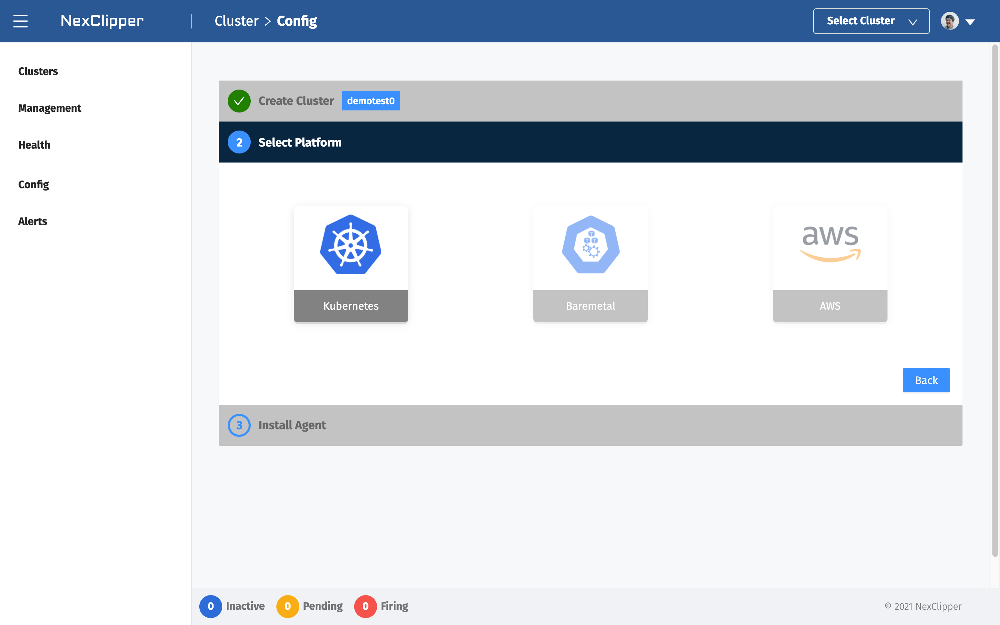
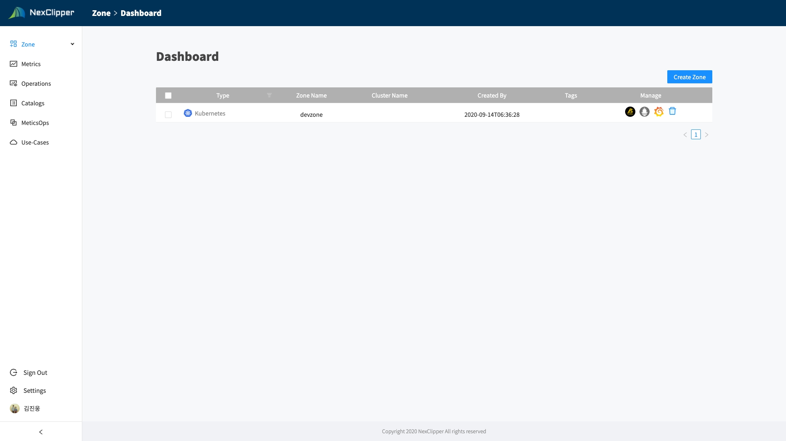
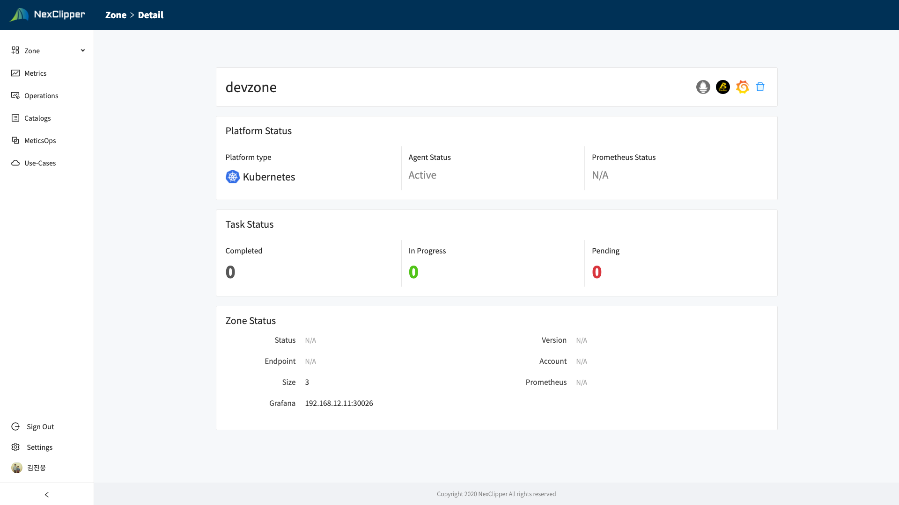

## Getting Started with NexClipper Cloud

### Overview

NexClipper 구성요소는 크게 3가지로 구성되어 있습니다.
NexClipper는 Kubernetes cluster 내에서 데몬셋(DaemonSet)과 파드(Pod), 디플로이먼트(Deployment)형태로 실행됩니다. 

|구성요소|리소스 타입|역할|
|---|---|---|
|Klevr Agent|DaemonSet|NexClipper Manager와 통신|
|Provbee|Pod|Provisioning 및 Task 처리|
|MetricOperator(준비중)|Deployment|메트릭 수집, 처리, 전송|

:::note
NexClipper Agent는 Kubernetes 기준 *1.15.12* 이상에서 테스트 되었습니다. 이하 버전에서는 문제가 발생할 수 있습니다.
:::

### Minimum Requirements

NexClipper는 기본적으로 Linux 환경에서 동작하도록 되어 있습니다. 

* Operating Systems : Linux(WSL포함), MacOS 10.14+
* Software
  * bash or zsh
  * curl
  * ssh-keygen
* Target Kubernetes Cluster : 1.15.12 이상

### Installation

설치 방법은 2가지 옵션이 있습니다. 

1. Remote Kubernetes
   * 원격으로 kube-apiserver로 통신이 가능한 환경 (kubeconfig 환경)
2. Local Kubernetes
   * Docker Desktop, Minikube, K3s, MicroK8s 등 로컬에서 실행하는 경우

bash 또는 zsh을 실행할 수 있는 환경에서 현재 연결된 클러스트를 확인하는 다음 명령을 실행합니다.
docker-descktop으로 kubernetes 환경을 구성했다면 다음과 유사한 결과를 얻을 수 있습니다. 
```bash
$ kubectl cluster-info
Kubernetes master is running at https://kubernetes.docker.internal:6443
KubeDNS is running at https://kubernetes.docker.internal:6443/api/v1/namespaces/kube-system/services/kube-dns:dns/proxy

```

#### 1. Remote Kubernetes

[https://nexclipper.io](https://nexclipper.io) 로 접속하여 `Get Started`를 클릭합니다.


---
Landing Page로 이동합니다.


---

[https://console.nexclipper.io/login](https://console.nexclipper.io/login) 로 이동합니다.


:::info
현재는 구글 인증만 지원하고 있습니다. GSuite 계정 포함 Gmail 아이디로만 사용 가능합니다.
:::

Google계정으로 로그인 합니다.


최초 사용자의 경우 아래와 같이 Welcome 화면을 확인할 수 있습니다.


NexClipper는 모든 클러스터의 단위가 Zone이라는 가상의 그룹 기반으로 동작합니다. Account에 맵핑된 API KEY 발급을 위해 다음 단계를 수행합니다.

Zone Name을 입력합니다. Zone Name은 리스트에 보여지는 값으로 사용자가 Zone 또는 Cluster를 구분하기 위한 입력값입니다.


프로비저닝할 대상 클러스터 또는 인프라를 선택합니다. 

:::info
현재는 쿠버네티스 클러스터만 지원합니다.
:::



선택한 클러스터에 설치할 Bootstrap 스크립트가 생성됩니다.


생성된 스크립트를 zsh, bash 구동이 가능한 Bastion 또는 Local에서 실행합니다.

```sh
curl -sL gg.gg/provbee | K3S_SET=N K_API_KEY="370c659d7cd948f78eee3a0581a099ba" K_PLATFORM="kubernetes" K_MANAGER_URL="https://console.nexclipper.io:8090" K_ZONE_ID="76" bash
```

`Continue`를 눌러 다음 단계로 이동합니다. 

설치되는 상태는 kubectl을 통해 확인할 수 있습니다.

nexclipper 네임스페이스에는 klevr 에이전트 데몬셋와 provbee 파드가 생성됩니다.   

```sh
> kubectl get pod -n nexclipper

NAME                READY   STATUS    RESTARTS   AGE
klevr-agent-9r5z9   1/1     Running   0          59m
klevr-agent-lcp2j   1/1     Running   0          59m
provbee             1/1     Running   0          59m
```

monitoring 네임스페이스에는 프로메테우스 에코시스템이 설치됩니다.

* prometheus-operator
* prometheus
* node-exporter
* kube-state-metrics
* alertmanager
* grafana

```sh
> kubectl get pod -n monitoring
NAME                                   READY   STATUS    RESTARTS   AGE
alertmanager-main-0                    2/2     Running   0          61m
alertmanager-main-1                    2/2     Running   0          61m
alertmanager-main-2                    2/2     Running   0          61m
grafana-67dfc5f687-w8kpw               1/1     Running   0          61m
kube-state-metrics-69d4c7c69d-jrfxl    3/3     Running   0          61m
node-exporter-4cgzp                    2/2     Running   0          61m
node-exporter-768m9                    2/2     Running   0          61m
node-exporter-bvlhx                    2/2     Running   0          61m
prometheus-adapter-66b855f564-tvb6r    1/1     Running   0          61m
prometheus-k8s-0                       3/3     Running   1          61m
prometheus-k8s-1                       3/3     Running   1          61m
prometheus-operator-57859b8b59-ns7g2   2/2     Running   0          61m
```

다시 콘솔로 돌아와 프로비저닝된 Zone 목록을 확인할 수 있습니다.   



해당 Zone을 클릭하시면 상세 내역을 확인할 수 있습니다.

* Zone Name
* Management
  * 추후 관리 기능이 포함될 영역으로 현재는 provbee, grafana 상태를 보여줍니다.
* Platform Status
  * 설치된 플랫폼과 에이전트, 프로메테우스 상태를 표시하는 영역으로 현재는 Agent 상태만을 보여줍니다.
* Task Status
  * 현재 개발중인 기능으로 NexClipper에서 수행되는 모든 Job과 Task 상태를 보여줍니다.
* Zone Status
  * Zone의 상태 정보로 현재는 Agent가 배포된 Node 대수와 Grafana Endpoint(NordPort)를 보여줍니다. 


